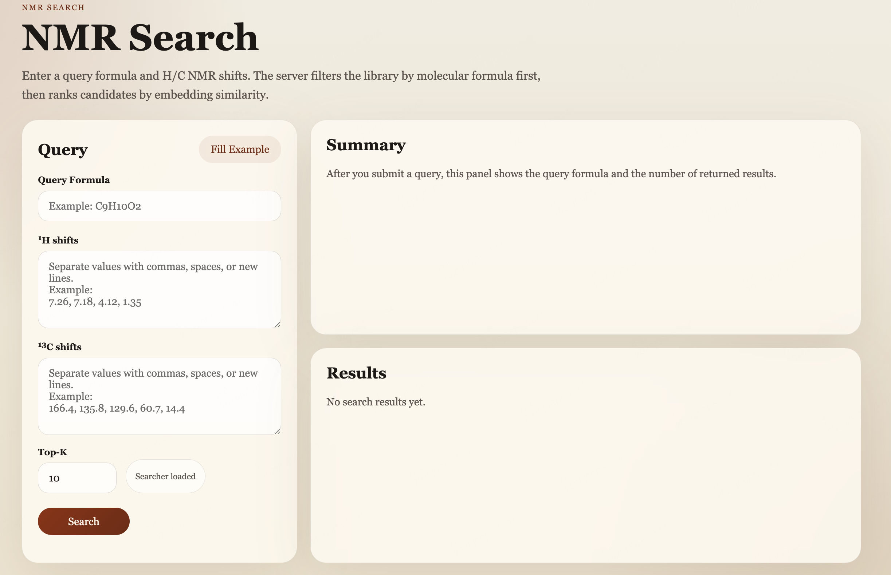

<h1 align="center">
A large-scale foundation model enables simulation-to-real
adaptation for nuclear magnetic resonance-based molecular
structure analysis
</h1>

<p align="center">
  <a href="https://huggingface.co/milesyc/ultranmr">
    
  </a>
  <a href="http://8.166.140.63/">
    
  </a>
</p>

UltraNMR provides NMR representation learning models and downstream pipelines for:
- Spetral library search
- De novo structure elucidation
- Functional group prediction
- Natural product superclass classification

## Web
Online demo:

- http://8.166.140.63/

It performs spectral library matching based on UltraNMR embeddings.



## Installation
Run the following code from the command line.

```shell
conda create -n ultranmr python=3.11 --yes
conda activate ultranmr
Git clone https://github.com/wuycM/UltraNMR.git
cd UltraNMR
pip install -e .
```

Download the UltraNMR checkpoints from https://huggingface.co/milesyc/ultranmr and place them in the `model_checkpoint/` directory.

### UltraNMR Embeddings
Extract embeddings for samples formatted like `data/case.jsonl`:

```shell
python get_ultranmr_embeddings.py
```

The script loads:

- `model_checkpoint/checkpoints_nce/model_epoch_1.pth`
- `data/case.jsonl`

## Data
Main JSONL files used in this repository:

- `data/NMRGym_train_balanced.jsonl`
- `data/NMRGym_val_balanced.jsonl`
- `data/NMRGym_test_balanced.jsonl`

The NMRGym dataset can be downloaded from:

- https://huggingface.co/datasets/meaw0415/NMRGym

After downloading, place the required JSONL files in the `data/` directory.

## De Novo Structure Elucidation

### Train
Default training config:

- `configs/config_nmrgym_train.json`

Run:

```shell
python train_nmrgym.py --config configs/config_nmrgym_train.json
```

### Inference
Greedy decoding on the NMRGym test set:

```shell
python inference_nmrgym.py \
  --checkpoint model_checkpoint/checkpoints_nmrgym_formula/model_best.pth \
  --test_data data/NMRGym_test_balanced.jsonl \
  --output denovo_results/NMRGym.json
```

Beam search inference:

```shell
python inference_nmrgym.py \
  --checkpoint model_checkpoint/checkpoints_nmrgym_formula/model_best.pth \
  --test_data data/NMRGym_test_balanced.jsonl \
  --output denovo_results/NMRGym_beam.json \
  --use_beam_search \
  --beam_size 10 \
  --top_k 1,5,10
```

Optional stereochemistry-aware evaluation:

```shell
python inference_nmrgym.py \
  --checkpoint model_checkpoint/checkpoints_nmrgym_formula/model_best.pth \
  --test_data data/NMRGym_test_balanced.jsonl \
  --output denovo_results/NMRGym_stereo.json \
  --consider_stereochemistry
```

## Functional Group Prediction

### Train
Default training config:

- `functional_group_prediction/config.yaml`

```shell
cd functional_group_prediction
python train_fg_decoder.py --config config.yaml
```

### Inference
Run test-set inference with the default config:

```shell
cd functional_group_prediction
python inference_test_dataset.py \
  --checkpoint ../model_checkpoint/checkpoints_nmrgym_fg/fg_best_model.pt \
  --config config.yaml
```

Outputs:

- `test_inference_fixed_threshold.json`
- `test_inference_optimal_thresholds.json`

These files are written into the checkpoint save directory resolved from the config.

## Natural Product Superclass Classification

### Train
Default training config:

- `configs/config_classification.json`

Run:

```shell
python train_classification.py --config configs/config_classification.json
```

### Inference

```shell
python inference_nmr_cls.py
```

Equivalent explicit command:

```shell
python inference_nmr_cls.py \
  --checkpoint model_checkpoint/checkpoints_nmrgym_cls/classification_model_best.pth \
  --config configs/config_inference_nmr_cls.json \
  --input_data data/NMRGym_test_balanced_with_class.jsonl \
  --output_name predictions.jsonl
```

Output:

- Predictions are saved to `<save_dir>/predictions.jsonl`

Notes:

- `inference_nmr_cls.py` expects `class_mapping.json` to exist in the same save directory.

## Acknowledgements

This repository is built on top of DreaMS (https://github.com/pluskal-lab/DreaMS).

We thank the developers of DreaMS for making their code publicly available.
